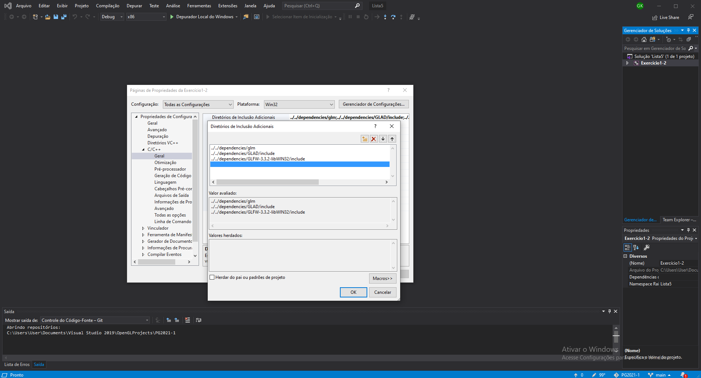
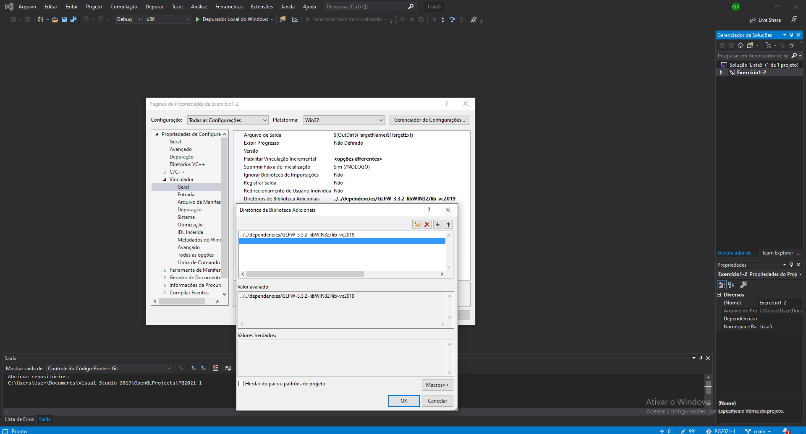
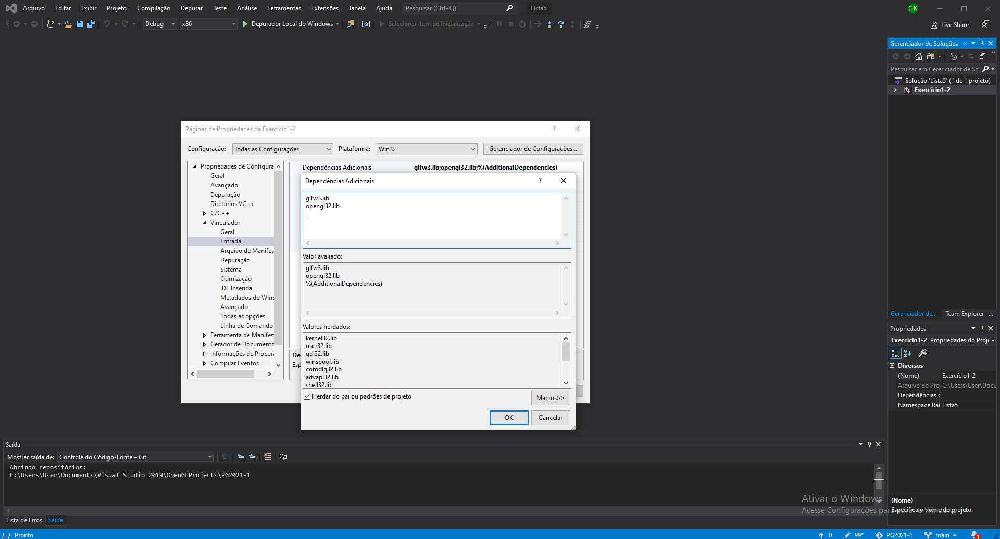

# OpenGL-InstaFilter
## InstaFilter
Programa feito em OpenGL para a disciplina de Processamento Gráfico de 2021.

Autores: Gabriel Ely Konrath, Guilherme Closs Fraga e Felipe Veronezi Peters.

### Instruções para compilar o programa:
- Fazer o download ou clone do repositório;
- Abrir a solução `InstaFilter.sln` (pode ser encontrada dentro da pasta baixada ou clonada `OpenGL-InstaFilter-main/InstaFilter`) no Visual Studio 2019;
- Verificar o modo de Debug da solução, este deve estar em `x86` na barra de feramentas superior do Visual Studio. Caso não esteja, deverá ser mudado para `x86`;
- Clicar em `Depurar Local do Windows` na barra de ferramentas superior do Visual Studio ou depurar através do atalho `F5` para executar a aplicação.

### Problemas na execução:
* Caso apareça algum erro de shader, modifique o número versão do core na primeira linha dos arquivos `transformation.fs` e `transformation.vs`, para uma inferior, exemplo: `#version 400 core`, ou menor;
* Caso tenha problema com as dependências, logo depois ao abrir o projeto no VS, faça a configuração do diretório das dependencias em:

Propriedades > C/C++ > Geral > Diretórios de Inclusão Adicionais > ... Adiciocione os diretórios `/glm`, `/GLAD/include` e `/GLFW/include` da pasta `/dependencies` deste projeto, como mostra a imagem a seguir;

Propriedades > Vinculador > Geral > Diretórios de Biblioteca Adicionais > ... Adiciocione o diretório `GLFW/lib` da pasta `/dependencies` deste projeto, como mostra a imagem a seguir;

Propriedades > Vinculador > Entrada > Dependências Adicionais > ... Adicione as bibliotecas `glfw3.lib` e `opengl32.lib`, como mostra a imagem a seguir.

### Informações sobre o código:
Código usado é C++ juntamente com o OpenGL e GLSL, e as bibliotecas adicionais GLAD, GLFW e GLM.
